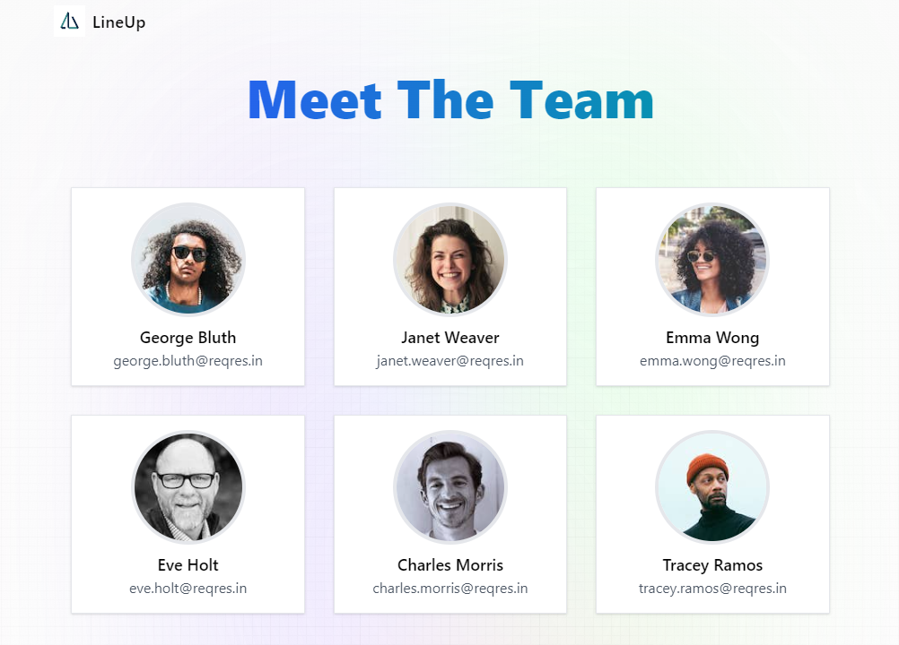

# LineUp - User Directory Web App

LineUp is a web application designed to showcase a directory of users, leveraging modern web technologies for a smooth, interactive experience. Built with React, Redux, and styled with TailwindCSS, this app provides a seamless way to view and manage user information. Below, you'll find detailed instructions on setting up the project, running the app locally, and suggestions for future enhancements.

## Features

- **User Profiles:** Display individual user details with options to view more information.
- **Dynamic Data Fetching:** Leverages Redux and Redux-Observable for efficient, asynchronous data fetching.
- **State Management:** Utilizes Redux for global state management, ensuring a consistent and predictable state across the app.
- **Responsive Design:** Utilizes TailwindCSS for a responsive layout that adapts to various screen sizes.
- **Interactive Navigation:** Implements React Router for dynamic, client-side routing.

## Tech Stack

- **React:** A JavaScript library for building user interfaces with component-based architecture.
- **Redux & Redux-Observable:** For global state management and handling asynchronous operations using RxJS and epics.
- **TailwindCSS:** A utility-first CSS framework for creating custom designs without leaving your HTML.
- **TypeScript:** Adds static type definitions to enhance code quality and readability.
- **React Router:** Declarative routing for React applications.

## Getting Started

### Prerequisites

- Node.js (latest LTS version recommended)
- npm or yarn

### Installation

#### From GitHub

1. Clone the repository to your local machine:
   `git clone https://github.com/max-mackie/users-app`
2. Navigate into the project directory:
   `cd line-up`

#### From ZIP File

1. Download the ZIP file from the GitHub repository page.
2. Unzip the file to your desired location.
3. Open your terminal and navigate into the unzipped project directory.

### Install Dependencies

Install the project dependencies by running:
`npm install`
or if you prefer yarn:
`yarn install`

### Running the App

- **Development Mode:**
  Start the application with hot reloading enabled:
  `npm run start`
  or using yarn:
  `yarn start`
- **Production Build:**
  Generate a production build of the application:
  `npm run build`
  or:
  `yarn build`
  Serve the production build locally (requires a server like `serve`):
  `serve -s build`
- **Test Build:**
  To run the testing suite:
  `npm run test`

## Future Enhancements

- **User Management Features:** Implement create, update, and delete operations for user profiles.
- **Advanced Filtering and Sorting:** Allow users to filter and sort the directory by various criteria.
- **Authentication and Authorization:** Introduce user authentication to protect sensitive data and user operations.
- **Custom User Settings:** Enable users to customize their viewing preferences and profile settings.
- **Performance Optimization:** Implement lazy loading and code splitting to enhance app performance.
- **Internationalization:** Add support for multiple languages to cater to a global audience.
- **Accessibility Improvements:** Ensure the app is fully accessible, meeting WCAG guidelines.
- **Unit and Integration Testing:** Expand test coverage with Jest and React Testing Library for robustness.
- **User Feedback Collection:** Integrate a feedback system to gather user insights and improve the app.
- **Dark Mode:** Implement a dark mode theme for enhanced user experience in low-light conditions.
